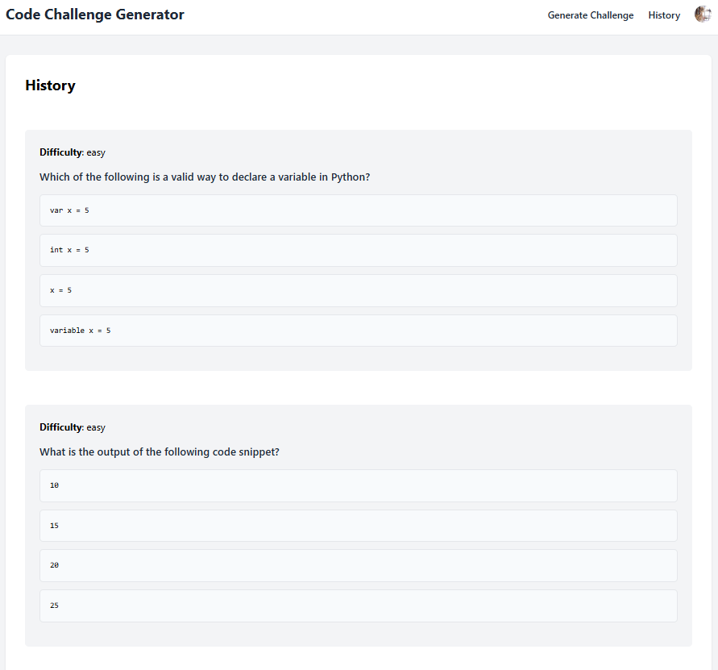
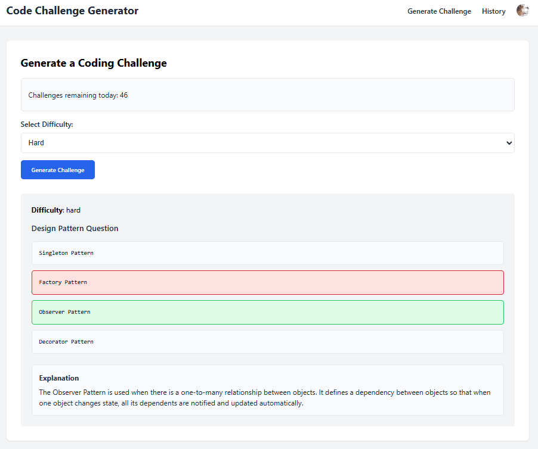

# 🚀 fastapi_react_ai

A full-stack AI-powered web app built with FastAPI and React.  
This project is part of my personal learning journey to understand how to build, integrate, and deploy modern web applications combining AI, frontend, backend, and authentication systems.

> Inspired by [Tech With Tim's Secure AI App Tutorial](https://www.youtube.com/watch?v=13tMEW8r6C0)

---

## 📌 Features

- 🔐 User Authentication with Clerk (Sign Up / Sign In)
- 🧠 Coding Challenge Generator using OpenAI API
- 📊 **Daily Quota System** — Users can generate up to **50 challenges per day** to prevent API abuse
- 🗂️ Challenge History stored in a local SQLite database
- 🌐 Full-stack app with API and UI integration

---

## 🧰 Tech Stack

| Layer        | Tech Used                         |
|--------------|-----------------------------------|
| Backend      | Python 3.13, FastAPI              |
| Frontend     | React, Vite, HTML, CSS, JavaScript |
| Auth         | Clerk                             |
| Database     | SQLite                            |
| AI           | OpenAI API                        |
| Dev Tools    | Node.js, Ngrok                    |

---

## 📷 Preview

Here’s how the app looks:

  

  

---

## ⚙️ Getting Started

🛠 **Note**: For detailed setup and explanation, follow the original video tutorial:
[Tech With Tim - Secure AI App](https://www.youtube.com/watch?v=13tMEW8r6C0)

This README intentionally skips deep setup steps, since the video does a clearer job explaining:

- Environment setup (Node.js, Python)
- Clerk configuration
- FastAPI + React integration
- Ngrok tunneling for local auth

---

## 📈 Project Status

🚧 **In Progress**  
Currently replicating the tutorial, then planning to add extra features beyond the original guide. Already added:

- ✅ Quota system to limit API usage
- 🔄 More features planned once fundamentals of JavaScript, HTML, and full-stack workflows are solid

---

## 🙌 Credits & References

- Tutorial by [Tech With Tim](https://www.youtube.com/watch?v=13tMEW8r6C0)  
- [Original GitHub Repo](https://github.com/techwithtim/SecureAIApp)

---

## 📄 License

No license yet — this is a learning project.
